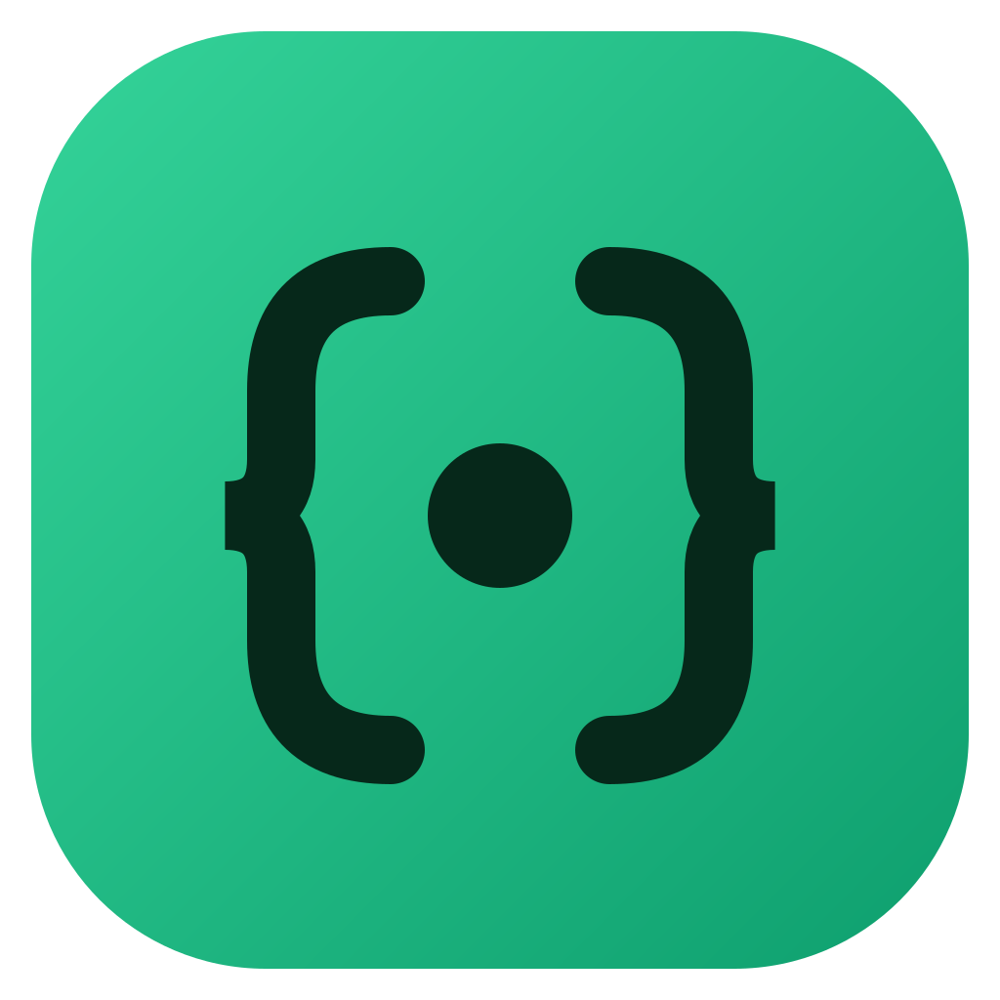

<p align="center">
  
</p>

<h1 align="center">Ognom</h1>

<p align="center">
  <b>The free MongoDB client that speaks to everyone.</b><br/>
  Engineers get a fast, precise workspace. Everyone else gets an AI studio that turns
  plain English into queries, charts, and answers — in the same app.
</p>

<p align="center">
  <a href="https://github.com/sunilksamanta/ognom/releases/latest"></a>
  &nbsp;
  
  &nbsp;
  <a href="LICENSE"></a>
</p>

---

## 📑 Table of contents

- [⚡ Why Ognom](#-why-ognom)
- [🔀 Two modes, one app](#-two-modes-one-app)
- [✨ Features](#-features)
  - [🖥️ Normal Mode — for people who write queries](#️-normal-mode--for-people-who-write-queries)
  - [🤖 Ognom Studio — for people who want answers](#-ognom-studio--for-people-who-want-answers)
  - [🧠 The Shell AI assistant](#-the-shell-ai-assistant)
- [📦 Installation](#-installation)
  - [🍎 macOS](#-macos)
  - [🪟 Windows](#-windows)
  - [🐧 Linux](#-linux)
- [🚀 Getting started](#-getting-started)
- [🤖 AI setup and cost](#-ai-setup-and-cost)
- [🔐 Security model](#-security-model)
- [🔌 Connect to anything](#-connect-to-anything)
- [🔧 Build from source](#-build-from-source)
- [📚 Docs and more](#-docs-and-more)
- [📄 License](#-license)

---

## ⚡ Why Ognom

Most database tools force a choice: **powerful but intimidating**, or **friendly but shallow**. Ognom refuses that trade-off.

- 🆓 **Free & open source.** No license keys, no locked "premium" tabs, no account, no telemetry.
- 🪶 **Native & lightweight.** Built with Tauri (Rust + your OS webview) — a tiny binary and a fraction of the memory an Electron app burns.
- 🗂️ **Many connections at once.** Open several servers as live **workspaces** and switch between them in one click — each keeps its own open tabs and sidebar.
- 🔐 **Secure by default.** Credentials are encrypted at rest with AES‑256‑GCM; one toggle moves the key into your OS keychain. Passwords are never sent back to the UI.
- 👥 **For developers _and_ the people they work with.** Flip one switch in the header and the whole app changes shape to fit the task in front of you.
- ❓ **Never stuck.** A built‑in **Help** page (the `?` in the header) has guided examples for both developers and product owners.

---

## 🔀 Two modes, one app

> You don't pick a tool for your skill level — you flip a switch for the task in front of you.

<table>
<tr>
<td width="50%" valign="top">

### 🖥️ Normal Mode
**For developers, DBAs & data engineers.**

A fast, keyboard-driven workspace with everything you expect from a serious MongoDB client — plus an AI assistant in the shell.

Browse · query · aggregate · edit · index · explain · optimize.

</td>
<td width="50%" valign="top">

### 🤖 Terminator Mode — *Ognom Studio*
**For product managers, analysts & founders.**

Chat with your data in plain English. Studio writes the query, runs it, charts it, and explains it — across one collection or your whole database.

Ask · join · chart · summarize · export.

</td>
</tr>
</table>

One app, as many connections as you need — the same safety guarantees underneath every workspace.

---

## ✨ Features

### 🖥️ Normal Mode — for people who write queries

| | |
|---|---|
| **Workspaces** | Connect to many servers at once and switch between them from the header — one click, no reconnect. Each workspace keeps its own open tabs and sidebar, and the ones you had open **reconnect automatically** next launch. |
| **Browse** | Databases & collections sidebar with sizes, a search filter, and a `⌘K` jump‑to‑collection palette. Toggle the sidebar with `⌘B`. Right‑click menus everywhere — refresh, copy, edit, delete. |
| **Two views, done well** | Documents render as **JSON** (collapsible, type‑colored, ObjectId/date aware) or a **table** (typed cells, sticky `_id`). |
| **Visual Query Builder** | Build filters as `field · operator · value` rows with **autocomplete from your latest 1,000 documents**, Match‑ALL / Match‑ANY logic, and a deep operator set (between, starts/ends with, regex, in/not‑in, type, exists…). Drop to raw JSON anytime. |
| **Aggregate** | A stage‑by‑stage pipeline builder: enable/disable, reorder, run‑to‑stage previews, copy as shell, or eject into the shell. |
| **Schema Analyzer** | Sample your data and instantly see every field, its types, fill‑rate %, and example values. |
| **Explain Plans** | Index usage, docs‑vs‑keys examined, timing, and a plain‑language verdict (*"collection scan — add an index"*) for find **and** aggregate. |
| **Guided Index Builder** | Templates (single, compound, text, geo, hashed, TTL), a visual key editor, and full options (unique, sparse, hidden, partial filters, collation) — no syntax to memorize. |
| **Export & Import** | Push query results or whole collections to **JSON / CSV**; import JSON / NDJSON. |
| **Move connections** | Export your saved connections to a file and import them on another machine — either **without passwords** (re‑enter on import) or a **passphrase‑encrypted backup** that carries credentials safely. Copy any connection's string (with or without the password) in two clicks. Deleting one asks you to type its name first. |
| **Shell** *(advanced)* | A real query editor — `db.users.find({}).sort({ gpa: -1 }).limit(5)` — with highlighting, history, a **drag‑resizable editor**, and helpers like `ObjectId()`, `ISODate()`, `NumberLong()`. |
| **Safety‑first** | Destructive actions require an explicit *"I know what I'm doing"* confirmation. |

### 🤖 Ognom Studio — for people who want answers

Flip the **Terminator** switch in the header, pick a **database** and a **collection** (or **Whole database**), and just chat.

| | |
|---|---|
| 💬 **A real conversation** | Ask in plain English, then follow up — *"now just the last 30 days"*, *"make it a pie chart"*. Studio keeps context across the thread. |
| 📊 **Instant charts** | Numeric answers render as animated **bar / line / pie / donut** charts with hover tooltips — switch types in a click, export as **PNG**. |
| 🔗 **Whole‑database joins** | Choose **Whole database** and Studio samples your collections, picks the right ones, and writes `$lookup` joins for you — *"orders per customer"*, *"revenue by product category"*. |
| 🔍 **See the query** | Every answer has a **View query** panel with the exact generated mongosh statement and what it does. Curious users learn; engineers trust. |
| 🕑 **Chat history** | Every conversation is saved. Reopen one from the **History** rail (or the welcome screen) and it restores the database, collection, and full transcript. |
| 💡 **Suggestions & summaries** | **Suggest questions** proposes smart, collection‑aware prompts; **Summarize** gives a plain‑language readout of any result set. |
| 🪙 **Token usage** | Each answer, each chat, and the whole conversation show how many tokens were used (hover for the input/output split). When you switch topics, Studio nudges you to start a fresh chat to keep costs down. |
| 🛡️ **Read‑only, always** | Ask Studio to insert, update, or delete and it politely refuses with a friendly note — Studio explores and visualizes, it never changes your data. |
| 📤 **Export** | Charts as **PNG**, results as **JSON / CSV**. |
| ➡️ **Hand off to the Shell** | On any answer, **Optimize in Shell** sends the generated query into Normal mode's developer shell to refine. |

### 🧠 The Shell AI assistant

The developer shell isn't just an editor — it has a built‑in AI co‑pilot:

- 🩹 **Fix with AI** — when a query errors, one click sends the statement **and the error** for an instant fix.
- ⚙️ **Optimize · Explain · Suggest indexes · Add safety limits** — one‑click actions, schema‑aware from your sampled fields.
- ✅ **Apply & run** — accept the AI's improved query and re‑run instantly.

---

## 📦 Installation

Grab the build for your OS from the **[latest release ⬇️](https://github.com/sunilksamanta/ognom/releases/latest)**. Installed apps **update themselves** from GitHub releases (signature‑verified) — so you only do this once.

| Platform | File |
|---|---|
| 🍎 **macOS** (Apple Silicon) | `Ognom_x.y.z_aarch64.dmg` |
| 🍎 **macOS** (Intel) | `Ognom_x.y.z_x64.dmg` |
| 🪟 **Windows** | `Ognom_x.y.z_x64-setup.exe` (or the `.msi`) |
| 🐧 **Linux** | `.AppImage`, `.deb`, or `.rpm` |

### 🍎 macOS

**1. Pick the right build.** Apple menu → **About This Mac**. If it says **Apple M1/M2/M3/M4…** (Apple Silicon), download the **`aarch64`** `.dmg`; if it says **Intel**, download the **`x64`** `.dmg`. *(Picked the wrong one? The Intel build also runs on Apple Silicon via Rosetta, but the native `aarch64` build is faster — prefer it.)*

**2. Install.** Open the `.dmg` and drag **Ognom** into your **Applications** folder.

**3. First launch — clear Gatekeeper (one command).** Ognom is open source and distributed outside the App Store, so macOS quarantines it on download. The one step that works on **every Mac** — and is **required on Apple Silicon** — is to remove that quarantine flag. Open **Terminal** and run:

```bash
xattr -dr com.apple.quarantine /Applications/Ognom.app
```

Then double‑click **Ognom** in Applications. That's it — you only do this once. ✅

<details>
<summary><b>Why is this needed? (and why right‑click → Open isn't enough on Apple Silicon)</b></summary>

macOS adds a `com.apple.quarantine` flag to anything you download. Because Ognom isn't signed with a paid Apple Developer certificate, Gatekeeper blocks the quarantined app — but the message differs by chip:

- **Apple Silicon (M‑series):** macOS shows *"Ognom is damaged and can't be opened."* There is **no** right‑click → Open or "Open Anyway" escape for the *damaged* verdict — Apple Silicon strictly enforces code signatures, so the quarantine flag **must** be removed with the command above.
- **Intel:** macOS shows the gentler *"unidentified developer"* warning, which right‑click → Open *can* bypass.

The `xattr` command simply strips the download flag so macOS treats the app like one you built yourself. Notarized apps from a paid Developer account skip all of this — Ognom is free and open source, and the code is right here for you to read or build yourself.
</details>

<details>
<summary><b>Intel Mac alternative — right‑click → Open (no Terminal)</b></summary>

On an **Intel** Mac you can skip the command:

1. In **Finder**, open **Applications**.
2. **Right‑click** (or Control‑click) **Ognom** → **Open**.
3. Click **Open** in the dialog. macOS remembers your choice.

If you instead see a *"damaged"* message (typical on Apple Silicon), use the `xattr` command above — right‑click → Open won't clear it.
</details>

### 🪟 Windows

1. Download **`Ognom_x.y.z_x64-setup.exe`** (NSIS installer) — or the **`.msi`** if your org prefers MSI.
2. Run it. Because the app isn't code‑signed with a paid certificate, **SmartScreen** may show *"Windows protected your PC."* Click **More info → Run anyway**.
3. Follow the installer. Launch **Ognom** from the Start menu. Updates install automatically going forward.

### 🐧 Linux

Pick the package that matches your distro. You may need GTK/WebKit runtime libraries (`libwebkit2gtk-4.1`, `libgtk-3`) — most desktops already have them.

<details>
<summary><b>AppImage (works almost everywhere)</b></summary>

```bash
chmod +x Ognom_x.y.z_amd64.AppImage
./Ognom_x.y.z_amd64.AppImage
```

If it won't start, install FUSE (`sudo apt install libfuse2` on Debian/Ubuntu).
</details>

<details>
<summary><b>Debian / Ubuntu (.deb)</b></summary>

```bash
sudo apt install ./Ognom_x.y.z_amd64.deb
# or: sudo dpkg -i Ognom_x.y.z_amd64.deb && sudo apt -f install
```
</details>

<details>
<summary><b>Fedora / RHEL (.rpm)</b></summary>

```bash
sudo dnf install ./Ognom-x.y.z-1.x86_64.rpm
# or: sudo rpm -i Ognom-x.y.z-1.x86_64.rpm
```
</details>

---

## 🚀 Getting started

1. **Connect.** Click the connection name (top‑left) → **New connection**. Paste a connection string, or fill in host/auth/TLS under *Advanced*. Connect to more servers any time and switch between them from the same menu.
2. **Explore (Normal mode).** Click a collection in the sidebar, or press `⌘K` to jump by name. Browse, build queries, aggregate.
3. **Ask (Terminator mode).** Flip the header switch to **Terminator**, pick a database + collection (or **Whole database**), and type a question.
4. **Add your AI key.** Studio and the Shell assistant need an OpenAI key — see below.
5. **Stuck?** Hit the **`?`** in the header for the in‑app Help page with examples for both audiences.

---

## 🤖 AI setup and cost

Studio and the Shell AI assistant use OpenAI. Set it up in **Settings → Prompts & AI** (or the key button in the Studio header).

- 🔑 **Bring your own key.** Stored **locally** on your machine and sent only to `api.openai.com` from Ognom's backend — never through the web layer.
- 🧩 **One editable model.** Defaults to `gpt-5.4-nano`; change it to any model you prefer.
- ⚡🧠 **Normal vs Deep Think.** A single toggle controls reasoning on that same model — **Normal** stays fast, **Deep Think** reasons harder for tricky multi‑collection joins and ambiguous questions.
- 🪙 **Transparent usage.** Token counts are shown per answer, per chat, and per conversation (hover for input/output). A fresh chat doesn't re‑send the previous conversation, so it costs fewer tokens — Studio suggests one when you change topics.
- 🛡️ **Always safe.** AI‑generated queries run through Ognom's safe layer: results capped at **500** documents, an automatic `$limit` on aggregations, the generated query always visible, and **never any writes from a prompt**.

---

## 🔐 Security model

- Connection profiles live in your OS app‑data directory as JSON; **secrets are AES‑256‑GCM encrypted**.
- The 256‑bit master key is generated on first run and stored in a private (`0600`) key file by default — no permission prompts, ever. Flip **"Guard the encryption key with the OS keychain"** to move it into the **macOS Keychain / Windows Credential Manager / Secret Service** (saved connections keep working). If the keychain becomes unreachable, Ognom falls back to the key file and **tells you so in the UI** — no silent downgrades.
- The UI never receives stored secrets back; editing a connection keeps the stored password unless you type a new one.
- **Exports are honest about secrets.** A *no‑passwords* export is plain, portable metadata — safe to share. A *full backup* re‑encrypts credentials under a **passphrase you choose** (Argon2id → AES‑256‑GCM); the master key never leaves your machine, so a naive copy of the on‑disk file can't be decrypted elsewhere.
- The webview runs with a strict Content‑Security‑Policy and no remote content — Monaco and every asset are bundled locally, so the core app works fully offline.
- Your queries go to **your** MongoDB server. Studio's AI prompts go only to **your** configured AI provider (OpenAI) using **your** key.

---

## 🔌 Connect to anything

Standard & `mongodb+srv`, replica sets, all SCRAM mechanisms, X.509, LDAP, TLS with custom CA / client certificates, read preferences, timeouts — all under *Advanced*. Or just paste a connection string.

---

## 🔧 Build from source

**Prerequisites:** [Rust](https://rustup.rs), Node 20+, and the [Tauri prerequisites](https://tauri.app/start/prerequisites/) for your OS.

```bash
git clone https://github.com/sunilksamanta/ognom.git
cd ognom
npm install
npm run tauri dev      # run in development
npm run tauri build    # produce a bundle for your OS
```

---

## 📚 Docs and more

- **Shell syntax** → [MONGODB_SHELL_SYNTAX.md](MONGODB_SHELL_SYNTAX.md) — everything the embedded shell understands.
- **Releasing** → [RELEASING.md](RELEASING.md) — how builds are signed and shipped.
- **In‑app Help** → the `?` button in the header, with examples for developers and product owners.

---

## 📄 License

[MIT](LICENSE) — free for everyone, forever.

<p align="center"><sub>Built with Rust 🦀, Tauri, and React. Made for the people who query — and the people who just need answers.</sub></p>
