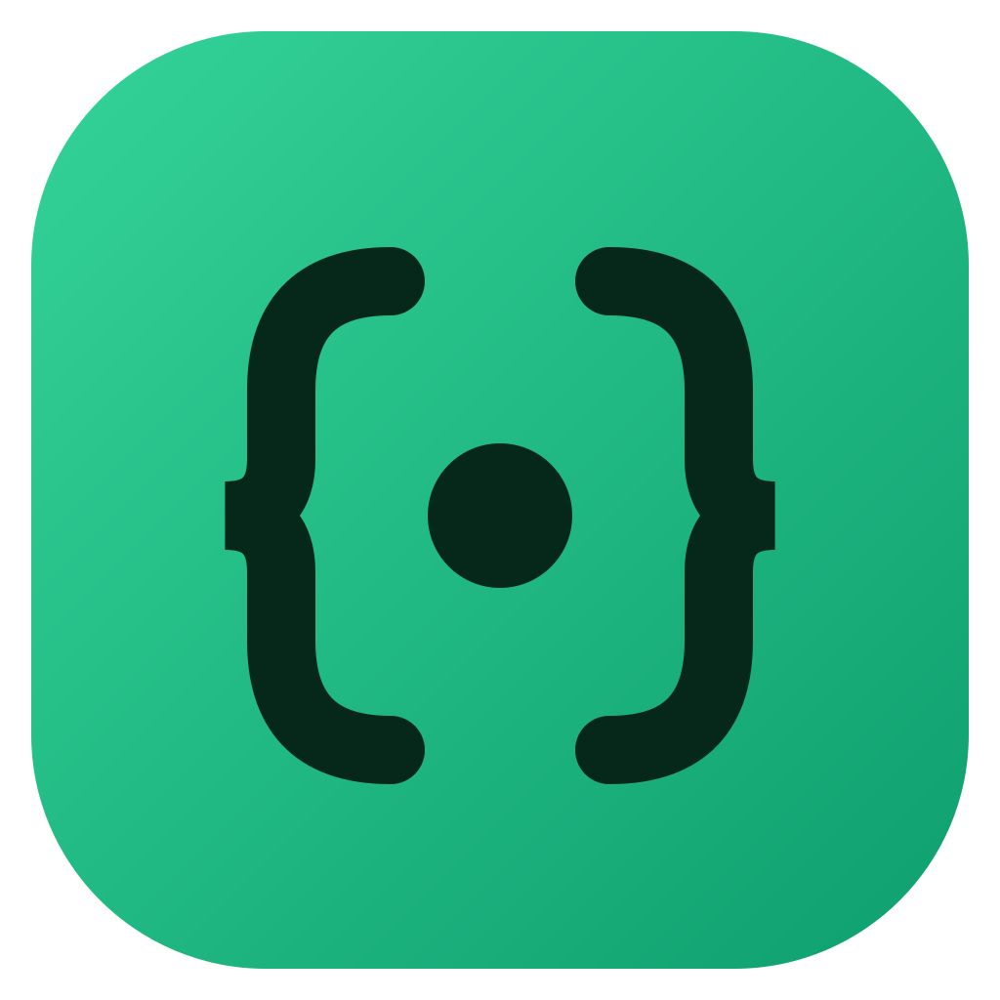
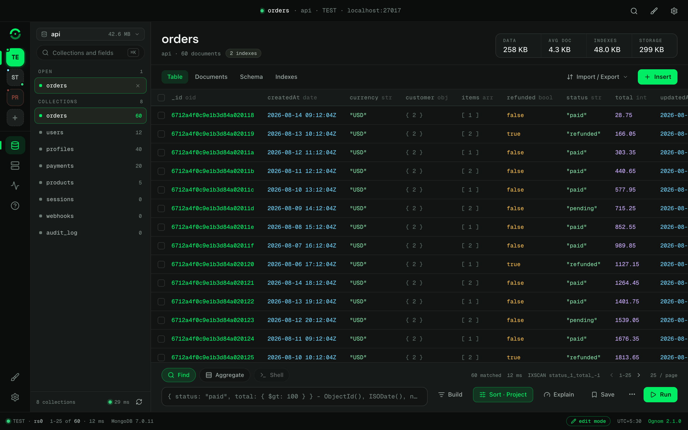
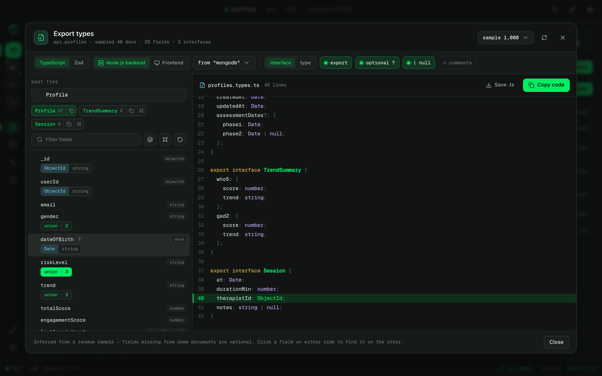
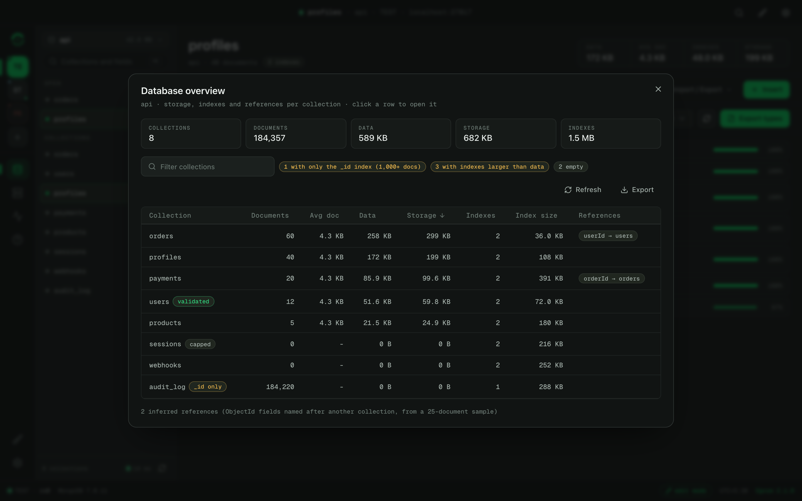
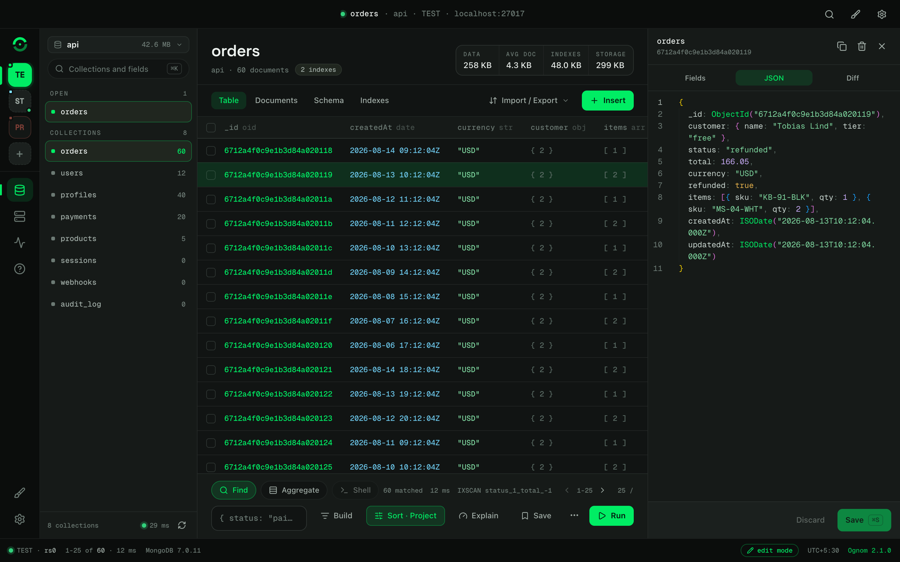

<p align="center">
  
</p>

<h1 align="center">Ognom</h1>

<p align="center">
  <b>The free, open-source MongoDB client for people who query.</b><br/>
  A fast native desktop console for macOS, Windows and Linux: table and document views, a typed
  document drawer, an aggregation builder, indexes, a TypeScript interface builder, SSH tunnels,
  and connections that know when they are production.
</p>

<p align="center">
  <a href="https://github.com/sunilksamanta/ognom/actions/workflows/ci.yml"></a>
  <a href="https://github.com/sunilksamanta/ognom/releases/latest"></a>
  <a href="https://github.com/sunilksamanta/ognom/releases"></a>
  <a href="LICENSE"></a>
  
  
  <a href="https://github.com/sunilksamanta/ognom/stargazers"></a>
</p>

<p align="center">
  <a href="https://ognom.dev"><b>Website</b></a> ·
  <a href="https://github.com/sunilksamanta/ognom/releases/latest"><b>Download</b></a> ·
  <a href="#getting-started">Getting started</a> ·
  <a href="https://github.com/sunilksamanta/ognom/issues">Report a bug</a>
</p>

<p align="center">
  
</p>

---

## Contents

- [Why Ognom](#why-ognom)
- [Screenshots](#screenshots)
- [What's new in 2.1](#whats-new-in-21)
- [Features](#features)
- [Production, read-only and backups](#production-read-only-and-backups)
- [Installation](#installation)
- [Getting started](#getting-started)
- [Keyboard shortcuts](#keyboard-shortcuts)
- [Security model](#security-model)
- [Build from source](#build-from-source)
- [Project layout](#project-layout)
- [Contributing](#contributing)
- [License](#license)

---

## Why Ognom

- **Free and open source.** MIT licensed. No account, no license key, no locked "premium" tabs, no telemetry.
- **Native and light.** Built with Tauri 2 and Rust on your OS webview, so it starts fast and uses a fraction of the memory of an Electron app.
- **Many connections at once.** Every saved connection is a colour-tagged tile on the rail. Keep several live, switch in one click, and each keeps its own tabs, picker and query state.
- **Knows what production is.** A connection marked Production opens read-only. Writes are blocked in the backend until you switch to edit mode, and Ognom asks first.
- **A query never hides its cost.** Matched count, timing and the winning plan sit right above the query box.
- **From data to code.** Sample a collection and get TypeScript interfaces or Zod schemas you can paste straight into your app.

---

## Screenshots

<table>
  <tr>
    <td width="50%"><br/><sub><b>Interface builder.</b> A sampled collection as TypeScript or Zod, nested objects split into their own interfaces.</sub></td>
    <td width="50%"><br/><sub><b>Database overview.</b> Sizes and indexes for every collection, with what needs attention flagged.</sub></td>
  </tr>
  <tr>
    <td colspan="2"><br/><sub><b>Document drawer.</b> Edit a document field by field or as JSON, and check the diff before saving.</sub></td>
  </tr>
</table>

---

## What's new in 2.1

| | |
|---|---|
| **Interface builder** | Turn a collection's schema into TypeScript interfaces or Zod schemas, for a Node.js backend or a frontend. Split nested objects into their own interfaces from the UI. |
| **SSH tunnels** | Reach databases behind a bastion with a private key, a password or ssh-agent. Host keys are verified. |
| **Database overview** | Sizes, index counts and storage for every collection in one table, with flags for what needs attention. Exports as CSV or JSON. |
| **Connection health** | Live latency to the active server in the picker footer; the active connection is a solid tile on the rail. |
| **Tab numbers** | The same collection open in several tabs shows `#1`, `#2`, ... everywhere. |
| **Smoother editing** | Saved connection strings now show their host and username when edited; counts load in one go and survive workspace switches. |

See the [release notes](https://github.com/sunilksamanta/ognom/releases) for the full list.

---

## Features

### Connections

- Paste a `mongodb://` or `mongodb+srv://` connection string, or fill in host and credentials. Ognom reads either form.
- MongoDB Atlas, self-hosted servers, replica sets and sharded clusters.
- SCRAM-SHA-1, SCRAM-SHA-256, X.509 and LDAP (PLAIN) authentication; TLS with a custom CA or client certificate; read preferences, timeouts, pool size and extra URI options.
- **SSH tunnels** through a bastion or jump host, with a key file (and optional passphrase), a password or ssh-agent. Host keys are checked against `~/.ssh/known_hosts`; a host seen for the first time is remembered, and a changed key is refused.
- Name, colour tag and **session mode** per connection: Read & write, Read-only, or Production.
- **Test** a connection before saving: latency, topology and server version.
- **Export and import** connections: without passwords (safe to share), or as a passphrase-encrypted backup that carries credentials.

### Browse and query

- **Table** and **Documents** views with BSON-aware colouring, type hints in the headers, multi-select and bulk delete.
- A **picker** with the database switcher, one search across collections, open tabs, pinned collections, document counts and saved queries.
- A **query dock** that accepts mongosh syntax as written: `{ status: "paid", total: { $gt: 100 } }`, `ObjectId()`, `ISODate()`, `new Date()`, `/regex/i`, unquoted keys. Sort, projection, a visual query builder, pagination and saved queries.
- **Explain** shows index usage, documents and keys examined, timing, and names the index a collection scan wants.
- **Find anything** with ⌘K: collections, databases, connections and actions.

### Edit documents

- Click any row to open the **drawer**. **Fields** edits values inline and keeps BSON types. **JSON** edits the whole document in shell syntax. **Diff** shows exactly what will change. Save with ⌘S.
- Insert with ⌘N, bulk update with update operators, bulk delete by filter.

### Aggregation

- One editor card per stage, 24 stage operators with starter snippets.
- Enable, disable and reorder stages; run to any stage.
- Per-stage stats: documents out, drop-off and cumulative time.
- Explain, copy as shell, or open in the shell.

### Schema and interface builder

- **Schema** samples up to 10,000 documents and lists every field with its types, mixed-type percentages, example values and coverage.
- **Export types** opens the interface builder:
  - TypeScript interfaces (or type aliases) or **Zod** schemas with `z.infer` types.
  - **Node.js backend** types (`ObjectId`, `Date`, `Decimal128` from `mongodb`, `bson` or `mongoose`) or **frontend** types (the strings they become in JSON).
  - Starts as one nested interface; extract any object, or the objects in an array, into its own named interface with one click.
  - Per field: `ObjectId` or `string`, literal unions from observed values (`"RED" | "AMBER" | "GREEN"`), optional or required.
  - Live, read-only code with two-way linking between fields and lines. Copy all, copy one interface, or save a `.ts` file.

### Indexes

- Size and usage for every index, with unused indexes called out.
- A create form with templates (single field, compound, text, 2dsphere, hashed, TTL) and unique, sparse and partial options.

### Database overview

- Documents, average size, data, storage and index sizes for every collection, with totals.
- Flags large collections with only the `_id` index, indexes larger than their data, and empty collections.
- Sort, filter, click through to a collection, and export as CSV or JSON.

### Moving data

- **Import and export** JSON, NDJSON, CSV and BSON (mongodump-compatible), streamed with progress and cancel. Export honours the current filter and sort.
- **Copy a collection** to another database or any open connection, with an optional filter and index copy.
- **Diff two collections** by `_id`, see field-level changes, and sync the differences.
- Duplicate, clear or drop a collection.

### Shell

- One statement at a time in mongosh syntax, with history and completions for collections and fields. Unbounded finds are capped and updates require operator documents.

### Server and operations

- **Server details**: version, topology, host and connection status.
- **Operations**: live `currentOp` with kill, a per-database profiler, and server metrics refreshed every 2 seconds. Missing privileges show a plain notice instead of an error.

### Appearance

- Eight themes (Mongo dark, Mongo light, Bloom, Bloom noir, Midnight, Mono, Contrast, Solar) plus Follow OS, and three densities. ⌘⇧T cycles themes.

---

## Production, read-only and backups

- Each connection has a session mode: **Read & write**, **Read-only** or **Production**.
- Read-only and Production workspaces open with writes blocked. The status bar shows the mode; click it to switch to **edit mode** for the session. Production asks you to confirm first, and paints its tile and title dot red.
- The block is enforced in one place, the backend API layer, so no menu, shortcut, shell statement or `$out` stage can write to a read-only workspace.
- Dropping or clearing a collection requires typing its name and offers an export first. Deleting several documents offers a JSON backup of exactly those documents. Deleting a saved connection requires typing its name.

---

## Installation

Download the build for your OS from the **[latest release](https://github.com/sunilksamanta/ognom/releases/latest)**. Installed copies update themselves from GitHub releases, and updates are signature-verified, so you only do this once.

| Platform | File |
|---|---|
| macOS, Apple Silicon | `Ognom_x.y.z_aarch64.dmg` |
| macOS, Intel | `Ognom_x.y.z_x64.dmg` |
| Windows | `Ognom_x.y.z_x64-setup.exe` or `.msi` |
| Linux | `.AppImage`, `.deb` or `.rpm` |

### macOS

1. **Pick the right build.** Apple menu > About This Mac. Apple M1, M2, M3 or M4: download the `aarch64` `.dmg`. Intel: download the `x64` `.dmg`.
2. **Install.** Open the `.dmg` and drag Ognom into Applications.
3. **Clear the quarantine flag once.** Ognom is distributed outside the App Store and isn't signed with a paid Apple certificate, so macOS quarantines the download. Open Terminal and run:

   ```bash
   xattr -dr com.apple.quarantine /Applications/Ognom.app
   ```

   Then open Ognom from Applications.

<details>
<summary><b>Why is this needed?</b></summary>

macOS adds a `com.apple.quarantine` flag to downloaded apps. For an unsigned app:

- **Apple Silicon** reports *"Ognom is damaged and can't be opened."* Right-click > Open can't bypass this, so the flag has to be removed with the command above.
- **Intel** shows the milder *"unidentified developer"* warning, and right-click > Open works.

The command only removes the download flag; the source is here if you'd rather build it yourself.
</details>

### Windows

1. Download `Ognom_x.y.z_x64-setup.exe` (or the `.msi`).
2. If SmartScreen shows *"Windows protected your PC"*, click **More info > Run anyway**. The installer isn't signed with a paid certificate.
3. Launch Ognom from the Start menu. Updates install automatically from then on.

### Linux

You may need the GTK and WebKit runtime (`libwebkit2gtk-4.1`, `libgtk-3`); most desktops already have them.

```bash
# AppImage (works almost everywhere; needs libfuse2 on some distros)
chmod +x Ognom_x.y.z_amd64.AppImage && ./Ognom_x.y.z_amd64.AppImage

# Debian / Ubuntu
sudo apt install ./Ognom_x.y.z_amd64.deb

# Fedora / RHEL
sudo dnf install ./Ognom-x.y.z-1.x86_64.rpm
```

---

## Getting started

1. **Connect.** Click **+** on the rail (or ⌘K > *New connection*). Paste a connection string or fill in host and credentials, add an SSH tunnel if the database sits behind a bastion, pick a session mode, press **Test**, then **Connect**.
2. **Open a collection.** Choose a database in the picker and click a collection. It opens in the Table view with the query dock underneath.
3. **Query.** Type a filter such as `{ status: "paid" }` and press ⌘⏎. Add sort and projection, check the plan with **Explain**, keep it with **Save**.
4. **Edit.** Click a row, change a field or the JSON, check the **Diff**, press ⌘S. On a production connection, switch to edit mode from the status bar first.
5. **Generate types.** Open the **Schema** view and press **Export types**. Pick TypeScript or Zod, backend or frontend, split out nested objects, then copy or save.
6. **Explore further.** Right-click a collection for pin, copy to another workspace, diff, duplicate, clear or drop. The database menu in the picker opens the database overview.

---

## Keyboard shortcuts

⌘ on macOS, Ctrl on Windows and Linux.

| Keys | Action |
|---|---|
| ⌘K | Find anything: collections, databases, connections, actions |
| ⌘O | Open a collection |
| ⌘N | Insert a document |
| ⌘⏎ | Run the query or pipeline |
| ⌘S | Save the document in the drawer |
| ⌘W | Close the active tab |
| ⌘B | Toggle the picker |
| ⌘, | Settings |
| ⌘⇧T | Cycle themes |
| Esc | Close overlays |

---

## Security model

- Connection profiles are stored as JSON in your OS app-data directory. Passwords, connection strings and SSH secrets are encrypted with **AES-256-GCM**.
- The 256-bit master key is created on first run and kept in a private key file (`0600`). One toggle in Settings moves it into the **macOS Keychain, Windows Credential Manager or Secret Service**. If the keychain becomes unavailable, Ognom falls back to the key file and says so in the status bar.
- Stored secrets are never sent back to the UI. Editing a connection keeps the saved password unless you type a new one.
- Exports are explicit about secrets: a **no-passwords** export is plain metadata that is safe to share; a **full backup** re-encrypts credentials under a passphrase you choose (Argon2id, then AES-256-GCM). The master key never leaves your machine.
- SSH host keys are verified against `~/.ssh/known_hosts` and Ognom's own list; a changed key is refused.
- The webview runs under a strict Content Security Policy with no remote content. Fonts, the editor and all assets are bundled, so the app works offline.
- Ognom talks only to your MongoDB servers, your SSH hosts and GitHub (for update checks). No telemetry, no analytics, no account.

Found a security problem? Please report it privately; see [SECURITY.md](SECURITY.md).

---

## Build from source

**Prerequisites:** [Rust](https://rustup.rs), Node.js 20+, and the [Tauri prerequisites](https://tauri.app/start/prerequisites/) for your OS.

```bash
git clone https://github.com/sunilksamanta/ognom.git
cd ognom
npm install
npm run tauri dev      # run the app in development
npm run tauri build    # build an installer for your OS
```

Tests:

```bash
npm test                       # frontend (Vitest)
cd src-tauri && cargo test     # backend (Rust)
```

`npm run dev` on its own runs the UI in a normal browser against an in-memory mock of the backend (`src/dev/mockTauri.ts`), which is handy for UI work and screenshots. It is never part of a production build.

---

## Project layout

```
src/                 React + TypeScript UI
  components/        rail, picker, canvas, dock, drawer, dialogs
  stores/            zustand stores (connections, explorer, settings, ui)
  lib/               API client, BSON helpers, type generator, Monaco setup
  styles/            theme kit and app styles (design-system tokens)
src-tauri/src/       Rust backend
  commands.rs        Tauri commands: connections, queries, admin, import/export
  profiles.rs        saved connections and URI parsing
  crypto.rs          AES-256-GCM vault and keychain
  ssh.rs             SSH tunnels
  shell.rs           mongosh-syntax parser
  typetree.rs        schema inference for the interface builder
```

More docs:

- [MONGODB_SHELL_SYNTAX.md](MONGODB_SHELL_SYNTAX.md): everything the query box and shell understand.
- [RELEASING.md](RELEASING.md): how builds are signed and shipped.
- In-app Help: the `?` on the rail.

---

## Contributing

- **Bugs:** open an [issue](https://github.com/sunilksamanta/ognom/issues/new/choose) using the bug template.
- **Questions and ideas:** use [Discussions](https://github.com/sunilksamanta/ognom/discussions).
- **Code:** read [CONTRIBUTING.md](CONTRIBUTING.md) for setup, guidelines and the checks to run.
- **Security:** report privately, as described in [SECURITY.md](SECURITY.md).

Everyone taking part is expected to follow the [Code of Conduct](CODE_OF_CONDUCT.md).

---

## License

[MIT](LICENSE). Free for everyone, forever.

<p align="center"><sub>Built with Rust, Tauri and React. Made for the people who query.</sub></p>
